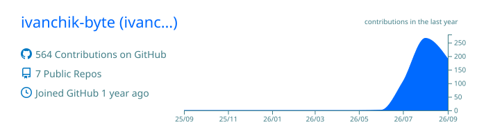
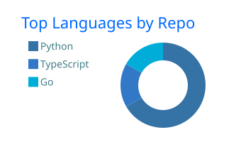
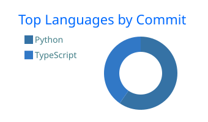
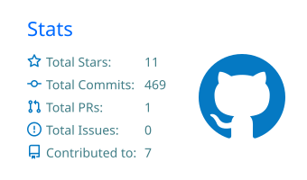
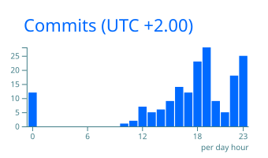

### Hi, I'm Ivan

I build backend services, automation pipelines, and tools around the Telegram ecosystem. Most of my work is in Python: asyncio, FastAPI, MTProto (Telethon and Hydrogram), and agent workflows. Right now, I am spending time with Go and Python.

### My tech stack:

OS:

Languages, Frameworks, Platforms and Libraries:

Tools:

### Contribution Activity:

<picture>
  <source media="(prefers-color-scheme: dark)" srcset="assets/github-snake-dark.svg" />
  <source media="(prefers-color-scheme: light)" srcset="assets/github-snake.svg" />
  
</picture>

### Links:

  
  

  

